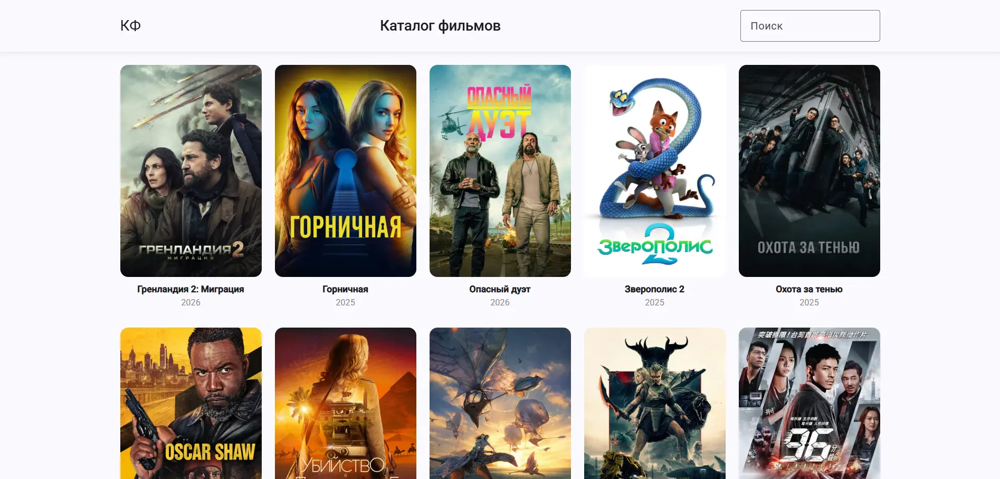

# Movie Catalog

A movie catalog application built with **Angular** that allows users to browse popular movies, search for titles, and view detailed movie information in a modern UI.

The project uses **TMDB API** as the data source.

---

## Preview



### Live Demo
https://nick-konstantinov.github.io/movie-catalog-test/

## Getting Started

Follow these steps to run the project locally.

### Clone the repository

```bash
git clone https://github.com/nick-konstantinov/movie-catalog-test.git
cd movie-catalog
```

### Install dependencies

```bash
npm install
```

### Environment Setup

For security reasons, the TMDB API key is not stored in the repository.

Navigate to:

```cpp
src/environments/
```

Rename the template file:

```cpp
environment.template.ts → environment.ts
```

Open environment.ts and insert your TMDB API key:

```cpp
export const environment = {
  production: false,
  tmdbApiKey: 'YOUR_TMDB_API_KEY',
  tmdbApiUrl: 'https://api.themoviedb.org/3',
  tmdbImageUrl: 'https://image.tmdb.org/t/p/w500',
  tmdbLanguage: 'ru-RU'
};
```

### How to Get a TMDB API Key
1. Create an account at https://www.themoviedb.org/
2. Go to Account Settings → API
3. Generate an API key
4. Paste it into environment.ts

### Run the Development Server

```bash
ng serve
```
Open your browser:

```cpp
http://localhost:4200/
```
The app will automatically reload when you modify source files.

### Production Build

```bash
ng build
```

The build artifacts will be stored in:
```cpp
dist/
```

### Features

- Browse popular movies
- Movie search with URL state
- Detailed movie popup (poster, genres, description, rating)
- Load more pagination
- Scroll-to-top button
- Responsive layout (mobile-friendly)
- Smooth UI interactions
- 404 page
- Footer with TMDB attribution

### Tech Stack

- Angular
- TypeScript
- Angular Material
- RxJS
- TMDB API

### Data Source

All movie data is provided by:
https://www.themoviedb.org/

### Author

Developed by Nick Konstantinov
